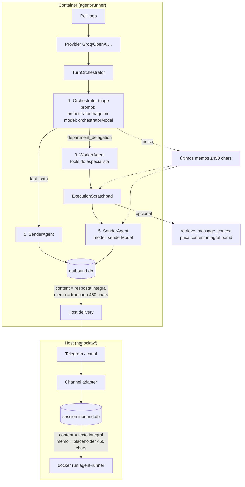

# Fluxo completo do agente (turn)

Documento de referência para o stack **multi-agente** atual (`OrchestratorAgent` → `WorkerAgent` → `SenderAgent`).  
O diagrama antigo em [nanoclaw/docs/ARCHITECTURE_WORKFLOW.md](../nanoclaw/docs/ARCHITECTURE_WORKFLOW.md) está desatualizado (fala em `ToolRouter` + Stage 1/2 monolítico).

Prompts internos do agent-runner ficam em **inglês** (`nanoclaw/container/agent-runner/src/prompts/`). Resposta ao usuário segue o idioma da mensagem.

---

## Diagrama

---

## Passo a passo

### 1. Entrada (host)

- Mensagem chega no adapter (ex.: Telegram).
- Gravada em `messages_in` com:
  - **`content`**: JSON/texto **completo** (o que o usuário mandou).
  - **`memo`**: placeholder mecânico (≤ 450 chars) até o container processar o turn; depois é **substituído** pelo memo semântico.
- **Não** chama LLM na entrada.

### 2. Container acorda

- `poll-loop` lê mensagens `pending`, monta o **prompt atual integral** e chama o provider.
- O histórico em `continuation` guarda **só memos** (`{ role, memo }`), nunca texto integral.
- O índice de contexto (orquestrador, worker, sender) lê **memos** do SQLite via `MemoService.getRecentMemos`.

### 3. Triagem (orquestrador)

- Arquivo: `nanoclaw/container/agent-runner/src/prompts/orchestrator.triage.md`
- Modelo: `orchestratorModel` (ex.: `openai/gpt-oss-120b` no `container.json`)
- Catálogo `{CATALOG}` é montado em runtime de `AgentRegistry` (departamentos + agentes) — **não** está hardcoded no prompt.
- Decisão JSON:
  - **`fast_path`**: só conversa; sender sem tools.
  - **`department_delegation`**: escolhe `departmentId` / `agentId` do catálogo; `taskDescription` = pedido do usuário.

### 4. Worker (se delegou)

- Especialista (ex.: `productivity_attendant`) com tools isoladas (`google_gmail`, …).
- Scratchpad começa com:
  - objetivo do usuário (**texto integral**),
  - índice dos últimos **memos** (id + até ~450 chars cada).
- Se precisar do texto antigo completo → tool **`retrieve_message_context`** (`MemoService.getFullMessage`).

### 5. Sender (voz final)

- Modelo: `senderModel`
- Monta persona (`PersonaLoader`), memos (`ContextPack`), memória longa se o orquestrador pediu.
- Entrega texto final no Telegram.

### 6. Saída

- `writeMessageOut`:
  - **`content`**: resposta **completa**.
  - **`memo`**: memo semântico gerado no fim do turn (ou truncamento mecânico se não vier preenchido).

---

## Sistema de memos (resumo vs completo)

| O quê | Completo? | Limite | Como |
|--------|-----------|--------|------|
| Mensagem **atual** do usuário | Sim | — | Vai inteira no `prompt` / `taskDescription` |
| Histórico no SQLite `content` | Sim | — | Sempre guardado |
| Coluna `memo` (inbound host) | Não | **450** chars | Placeholder na gravação; **substituído** pelo semântico após o turn |
| Coluna `memo` (outbound container) | Não | **450** chars | Semântico gravado em `writeMessageOut` |
| `continuation` / `updatedHistory` | Não | memo only | Só `{ role, memo }` — nunca `content` integral |
| Índice pro orquestrador / worker / sender | Não | memo + id | `MemoService.getRecentMemos` |
| Texto antigo sob demanda | Sim | — | `retrieve_message_context(message_id)` |

### Gerador semântico (LLM) — persiste no DB

- Classe: `MemoService.generateSemanticMemo` ([`memo-service.ts`](../nanoclaw/container/agent-runner/src/services/memo-service.ts))
- Prompt: `prompts/memo.summarize.md` (inglês, máx. **450** chars)
- Regra: se texto ≤ 450 chars → usa o texto; se maior → **1 chamada LLM** (`purpose: semantic_memo`) para resumir.
- Chamado no **fim de cada turn** em `OrchestratorAgent.finalizeTurnResult`:
  - **`userMemo`** → `MemoService.updateInboundMemo` para cada `inboundMessageId` do batch.
  - **`assistantMemo`** → passado no evento `result` e gravado em `messages_out` via `writeMessageOut({ memo })`.
- O histórico (`continuation`) recebe só os memos, não o texto integral.

---

## Modelos por papel (`container.json`)

| Campo | Papel |
|--------|--------|
| `orchestratorModel` | Triagem fast_path vs delegação |
| `senderModel` | Resposta final (e chamada `semantic_memo`) |
| `model` | Worker / default |

---

## Arquivos úteis

| Arquivo | Papel |
|---------|--------|
| `nanoclaw/container/agent-runner/src/poll-loop.ts` | Loop principal |
| `nanoclaw/container/agent-runner/src/agents/orchestrator-agent.ts` | Triagem + coordenação |
| `nanoclaw/container/agent-runner/src/agents/worker-agent.ts` | Tools do especialista |
| `nanoclaw/container/agent-runner/src/agents/sender-agent.ts` | Síntese final |
| `nanoclaw/container/agent-runner/src/services/memo-service.ts` | Memos + resumo semântico |
| `nanoclaw/container/agent-runner/src/services/context-pack.ts` | O que o sender recebe de contexto |
| `nanoclaw/container/agent-runner/src/tools/message-context.ts` | Recuperar mensagem integral |
| `nanoclaw/src/db/session-db.ts` | Memo inbound placeholder 450 chars (host) |

---

## Dev local

Ver também [DEV-LOCAL.md](DEV-LOCAL.md).

Logs de um turn: `nanoclaw/groups/<agente>/logs/groq_activity.log`, `agent_audit.jsonl`, `token_ledger.jsonl`.
