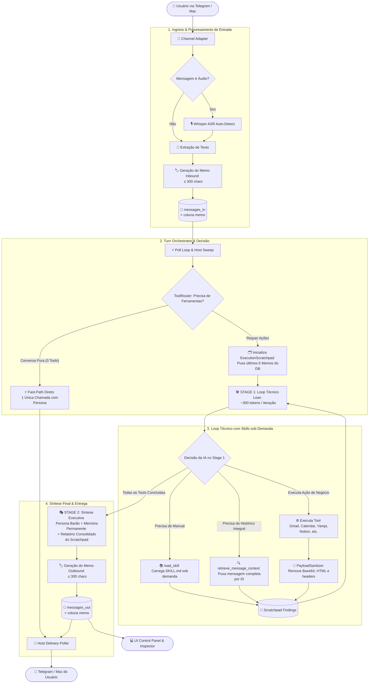

# 🚀 Arquitetura & Fluxo de Trabalho do NanoClaw v2

Este documento descreve o fluxo de execução de ponta a ponta do agente, desde a chegada da mensagem até a entrega no canal e no painel de controle.

---

## 🗺️ 1. Diagrama de Fluxo de Ponta a Ponta

---

## ⚙️ 2. Detalhamento de Cada Etapa do Fluxo

### 1. Ingress & Extração de Memo
1. **Entrada do Canal:** Recebe a mensagem do Telegram ou macOS. Se for áudio, o Whisper ASR faz a transcrição com detecção automática de idioma.
2. **Gravação com Memo:** Salva em `messages_in` (`inbound.db`) com o texto completo e preenche a coluna **`memo`** (resumo de até 300 caracteres).

---

### 2. Roteamento Inteligente & Fast-Path
* **Conversa Pura (Fast-Path):** Se o usuário mandar um cumprimento ou pergunta direta que não precisa de ferramentas, o sistema executa **1 única chamada direta** com Persona e Memória.
* **Ações Técnicas (Tool Path):** Se precisar de ferramentas, ativa o `TurnOrchestrator` em dois estágios.

---

### 3. Stage 1 — Loop Técnico com Memória de Execução
* **Contexto Inicial Mínimo (~300 tokens):**
  - Recebe apenas o objetivo atual + índice dos últimos 6 memos.
  - Recebe o catálogo compacto de skills em 1 linha por domínio.
* **Ferramentas sob Demanda:**
  - `load_skill({ name: "..." })`: Carrega manuais específicos de regras de negócio apenas se a IA decidir.
  - `retrieve_message_context({ message_id: "..." })`: Resgata o texto completo de mensagens antigas caso a IA necessite dos dados integrais.
  - Executa as ferramentas de negócio (`google_gmail`, `google_calendar`, `yampi_store`, `notion`, etc.).
* **Higiene de Payloads (`PayloadSanitizer`):** Limpa blobs binários base64, HTML bruto e cabeçalhos de rede antes de gravar no `ExecutionScratchpad`.

---

### 4. Stage 2 — Síntese Executiva do Barão
* Quando todas as ferramentas são concluídas, o orquestrador aciona o **Stage 2**:
  - Injeta a Persona do Barão (`instructions.prepend.md`).
  - Injeta a Memória Permanente da Empresa (`memory/index.md`).
  - Injeta o relatório consolidado gerado pelo `ExecutionScratchpad`.
* Gera a resposta elegante, cria o **`memo` de saída (≤ 300 chars)** e entrega no Telegram e no Dashboard.

---

## 📊 3. Tabela Comparativa de Eficiência

| Métrica | Arquitetura Antiga | Nova Arquitetura com Memos & Skills on Demand |
| :--- | :--- | :--- |
| **Histórico de Conversas** | 6.500+ tokens (tabelas antigas acumuladas) | **~60 a 90 tokens** (Índice de Memos) |
| **Manuais de Skills** | 2.774 tokens (despejo de todos os `SKILL.md`) | **~90 tokens** (Catálogo compacto, carregamento sob demanda) |
| **Payloads de Tools** | Brutos com HTML e headers de rede | **Sanitizados** (apenas dados de negócio) |
| **Custo por Interação** | R$ 0,04 a R$ 0,08 | **R$ 0,004 a R$ 0,007** (Redução de até 85%) |
| **Resiliência de Entrega** | Sujeito a alucinações de tags XML | **100% Determinístico** (Origin Routing pelo Sistema) |
